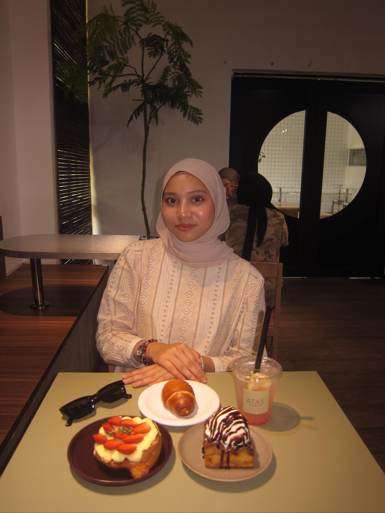

# Introduction

Hi! I'm Yusrina, a final-year Software Engineering student at Universiti Malaya. I am currently taking the Software Maintenance and Evolution course.

I expect to learn how real software is kept working and improved over time, and how to read and change code that someone else wrote.

- **About me**: I am working on my Final Year Project, SOPHiQ, an AI-powered platform for managing SOP documents.
- **Fun fact**: I enjoy eating a spicy malatang so much. >_<
- **Course expectations**: To gain hands-on experience in maintaining and evolving software, and to get better at teamwork tools like Git, branches and pull requests.

